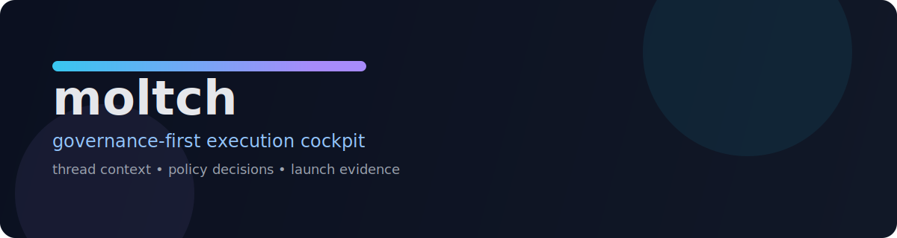

<p align="center">
  
</p>

# moltch

**moltch is a governance-first execution cockpit for human + agent teams.**

When delivery gets fast, trust usually gets fuzzy: chat decisions drift from issue state, approvals become implied, and launch calls happen without clean evidence. moltch is built to close that gap.

---

## the coordination problem (in one minute)

You have a live thread, two active PRs, and a launch decision due in an hour.
Everyone *thinks* they agree, but no one can answer these clearly:

- who owns the decision?
- what exact evidence justifies go/hold/no-go?
- is policy actually enforced, or just socially assumed?

moltch turns that chaos into an explicit control loop.

## what changes with moltch

Instead of scattered context, operators get one auditable flow:

```text
Thread pressure
   -> Cockpit context
      -> Issue/PR linkage
         -> Policy decision + reason code
            -> Evidence artifacts
               -> Launch gate verdict (go / hold / no-go)
```

This is the core promise: **faster execution without sacrificing decision integrity**.

## a three-minute operator walkthrough

**Minute 0** — an edge-case deploy concern appears in a thread.  
**Minute 1** — moltch links that discussion to active issue/PR context and policy references.  
**Minute 2** — launch-gate checks and evidence artifacts make the risk posture explicit.  
**Minute 3** — the operator records a reason-coded decision with traceability.

No guesswork. No “I thought someone checked that.”

## shipped controls (proof, not hype)

moltch already ships hard controls you can inspect:

- Launch-gate evidence schema + validator
  - `docs/operations/LAUNCH_GATE_EVIDENCE_PACKAGE_SCHEMA_V1.md`
  - `docs/operations/schemas/LAUNCH_GATE_EVIDENCE_PACKAGE_V1.schema.json`
  - `scripts/ops/validate_launch_gate_evidence.py`
- Dedicated launch-gate contracts CI signal
  - `.github/workflows/launch-gate-contracts.yml`
- Canonical launch signoff evidence index
  - `docs/operations/evidence/LAUNCH_EVIDENCE_INDEX_2026-03.md`
- Governance reason-code + conformance evidence
  - `docs/governance/POLICY_DECISION_REASON_CODE_CATALOG_V1_2.md`
  - `docs/governance/evidence/POLICY_DECISION_CONFORMANCE_SUMMARY_2026-03-14.md`

## quickstart (operator path)

```bash
git clone https://github.com/BoilerHAUS/moltch.git
cd moltch
bash scripts/docs/check_docs.sh
```

Then review the signoff entrypoint:

```bash
sed -n '1,220p' docs/operations/evidence/LAUNCH_EVIDENCE_INDEX_2026-03.md
```

## status (honest framing)

- **Shipped now:** launch-gate contracts, evidence tooling, policy conformance checks, roadmap drift guardrails
- **In progress:** README v2 narrative/visual refinement and operator onboarding polish

Canonical status mapping lives in: `docs/product/ROADMAP_V1.md`

## repository map

- `apps/web/` — web cockpit scaffold
- `services/api/` — API scaffold
- `docs/governance/` — governance contracts + reason-code system
- `docs/operations/` — runbooks, evidence, launch-gate controls
- `docs/product/` — roadmap, decision memos, commercial artifacts

## contribute

New here? Start by reading `docs/CONTRIBUTING.md`, then pick an open issue and follow the issue-first flow below.

- issue-first flow
- fork + branch execution
- PR-gated changes to `BoilerHAUS/moltch:main`
- no direct push to protected default branch
- merge only after required checks + review
